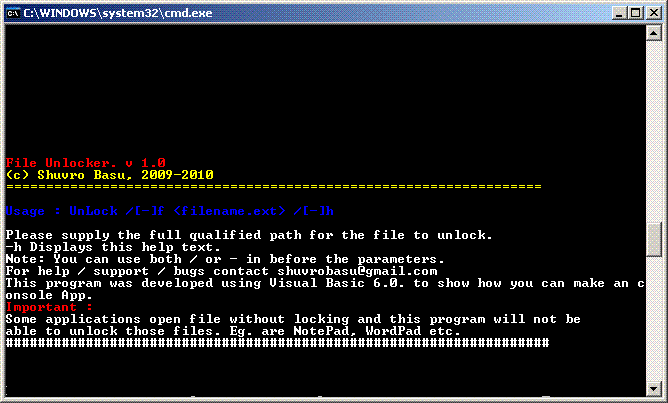



## UnLocker

### Description

Did you encounter a "File Locked by Application" or "Unable to Delete file as it is locled by another application" situations? Well this nifty little program will help you unlock and close the file and application so you can Delete,re-edit or do whatever you want again... This app. is a VB console App!!!!
 
### More Info
 
Note: This code directly uses API calls to get the process thread and kills it, so any unsaved information will be lost from the file / app.

             |
---                |---
**Submitted On**   |2009-08-17 06:40:02
**By**             |[Shuvro Basu](https://github.com/Planet-Source-Code/PSCIndex/blob/master/ByAuthor/shuvro-basu.md)
**Level**          |Advanced
**User Rating**    |5.0 (10 globes from 2 users)
**Compatibility**  |VB 6\.0
**Category**       |[Files/ File Controls/ Input/ Output](https://github.com/Planet-Source-Code/PSCIndex/blob/master/ByCategory/files-file-controls-input-output__1-3.md)
**World**          |[Visual Basic](https://github.com/Planet-Source-Code/PSCIndex/blob/master/ByWorld/visual-basic.md)
**Archive File**   |[UnLocker2160148172009\.zip](https://github.com/Planet-Source-Code/shuvro-basu-unlocker__1-72365/archive/master.zip)

